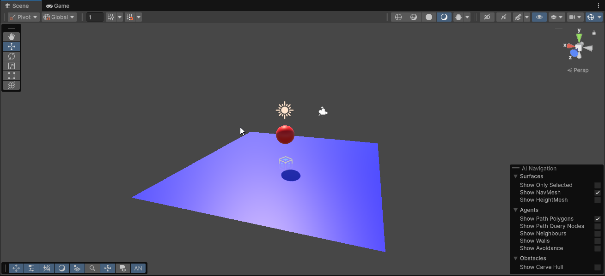
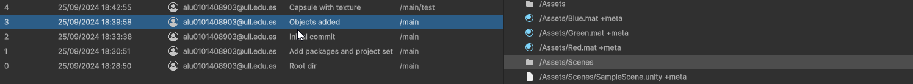
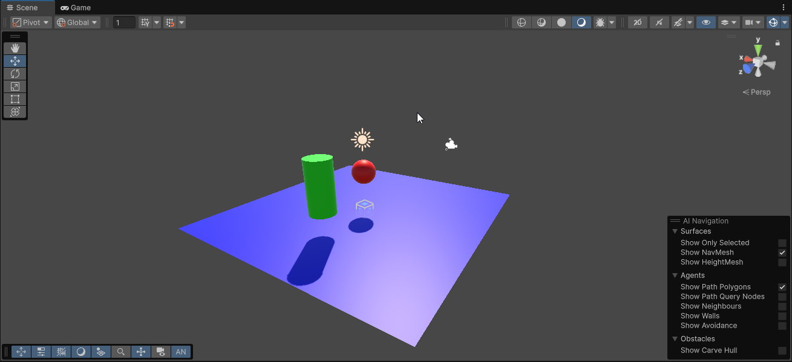
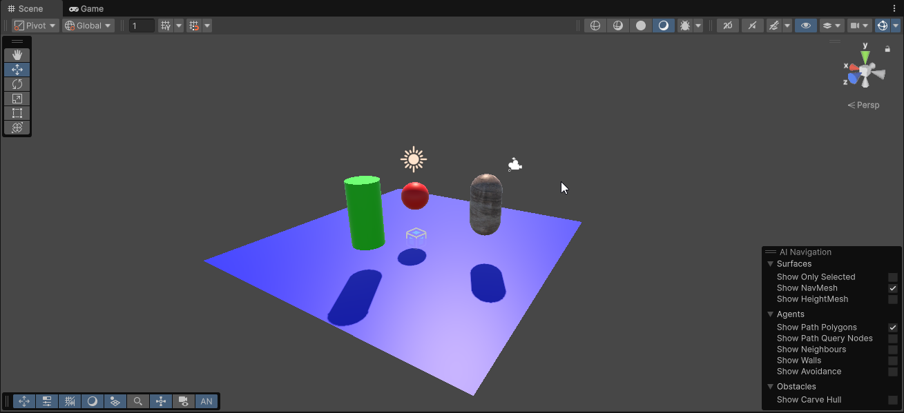

# Fundamentos del desarrollo de videojuegos
## Práctica 1.3
### Diego Herrera Mendoza
Unity Version Control

1. Crear un proyecto Unity 3D básico con control de versiones en Unity.
---
2. Realizar 2 cambios, agregando 2 objetos 3D, por ejemplo, una esfera y un plano. Añadirles material de color rojo y azul respecivamente. Grabar el proyecto.

---
3. Chequear los cambios en SCM

---
4. Agregar un nuevo objeto, por ejemplo, un cilindro verde, guardar los cambios.

---
5. Añadir una cápsula con una textura, agregar este cambio a una nueva rama.

---

